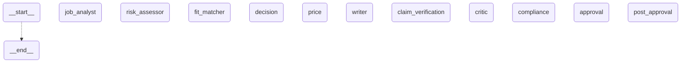
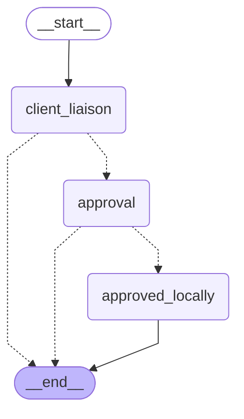

# LangGraph diagrams

Generated from the compiled graphs.

## Bid graph

```mermaid
---
config:
  flowchart:
    curve: linear
---
graph TD;
	__start__(<p>__start__</p>)
	job_analyst(job_analyst)
	risk_assessor(risk_assessor)
	fit_matcher(fit_matcher)
	decision(decision)
	price(price)
	writer(writer)
	claim_verification(claim_verification)
	critic(critic)
	compliance(compliance)
	approval(approval)
	post_approval(post_approval)
	__end__(<p>__end__</p>)
	__start__ -.-> __end__;
	classDef default fill:#f2f0ff,line-height:1.2
	classDef first fill-opacity:0
	classDef last fill:#bfb6fc

```

## Conversation graph

```mermaid
---
config:
  flowchart:
    curve: linear
---
graph TD;
	__start__([<p>__start__</p>]):::first
	client_liaison(client_liaison)
	approval(approval)
	approved_locally(approved_locally)
	__end__([<p>__end__</p>]):::last
	__start__ --> client_liaison;
	approval -.-> __end__;
	approval -.-> approved_locally;
	client_liaison -.-> __end__;
	client_liaison -.-> approval;
	approved_locally --> __end__;
	classDef default fill:#f2f0ff,line-height:1.2
	classDef first fill-opacity:0
	classDef last fill:#bfb6fc

```
